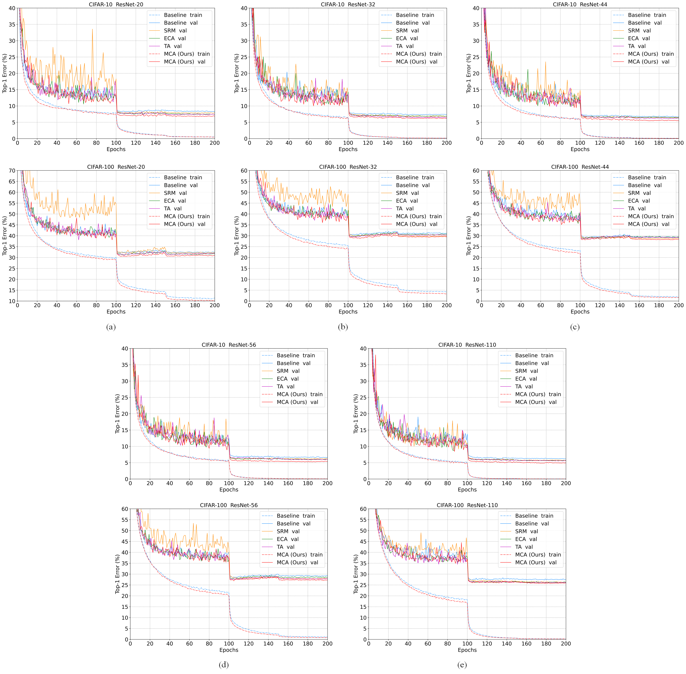

# Multidimensional Collaborative Attention Module

*By Yang Yu, Yi Zhang, Zeyu Cheng, Zhe Song, Chengkai Tang*.

**The official PyTorch implementation of "MCA: Multidimensional collaborative attention in deep convolutional neural networks for image recognition".**

## Approach

  

  Figure 1: Schematic comparison of the proposed multidimensional collaborative attention module (d) to the ECA module (a), SRM (b), and CBAM (c).

  

  Figure 2: The overall architecture of the proposed MCA module with three branches.

**Description.** The top branch is used to capture the interaction between features in the spatial dimension W. Similarly, the middle branch is used to capture the interaction between features in the spatial dimension H. The bottom branch is responsible for capturing the interaction between channels. In the first two branches, we employ the permute operation to capture long-range dependencies between the channel dimension and either one of the spatial dimensions. Finally, the outputs from all three branches are aggregated by simple averaging in the integration phase.

**MCA.** Detail of implementations, including the module and the network, can be found in ``Cifar`` and ``ImageNet`` in this repository. 

## Our environments and toolkits

- OS: Ubuntu 18.04.1
- CUDA: 11.6
- Python: 3.9.12
- Toolkit: PyTorch 1.10
- GPU: RTX A6000 (4x)
- [thop](https://github.com/Lyken17/pytorch-OpCounter)
- [ptflops](https://github.com/sovrasov/flops-counter.pytorch)
- For generating GradCAM++ results, please follow the code on this [repository](https://github.com/jacobgil/pytorch-grad-cam)

## How to plug the proposed MCA block into the basic building units in ResNets

  

  Figure 3: Schema of the original residual block (left), MCA integrated into a basic residual block (middle), and MCA integrated into a bottleneck residual block (right).

## Overview of Results

### Comparisons of training and validation curves for networks on CIFAR-10/100

  

  Figure 4: Comparisons of training and validation curves of our MCA and several attention methods (i.e., SRM, ECA, and TA) on CIFAR-10/100.

### Comparisons of training and validation curves for networks on ImageNet-1K

  

  Figure 5: Comparisons of training and validation curves for ResNets with and without the MCA module on ImageNet-1K.

### Image classification on the ImageNet-1K validation set

  

  Figure 6: Comparisons of efficiency (i.e., Parameters and FLOPs) and effectiveness (i.e., Top-1/Top-5Acc) of different attention methods on ImageNet-1K validation set when taking ResNet with 18, 34, and 50 layers as backbones.

## Citation
If you find MCA useful in your research, please consider citing:

## Contact Information

If you have any suggestion or question, you can leave a message here or contact us directly: yang_y9802@163.com. Thanks for your attention!